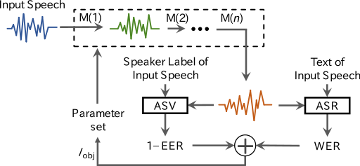

# Lightweight speaker anonymization [IEEE SLT2021]
*********************************
This recipe optimizes parameters of voice modification modules `M(*)` for speaker anonymization. Given training data (speech, text, speaker label), this recipe estimates the parameters that minimize `I_obj` consisting of WER (word error rate) and negative EER (equal error rate). 



## Requirement
- Python 3.6 or the later
- librosa
- soundfile
- functools
- joblib
- optuna
- shutil
- audiotsm
- scipy

## Anonymization using pre-optimized parameters
You can anonymize speech using pre-optimized model parameters. For example,
```
python scripts/anonymize.py params/vctk/male/R.json      # resampling only
python scripts/anonymize.py params/vctk/male/R-MS.json   # resampling & MS smoothing.
```

This script loads `data/vctk/p227_001.wav` and saves the anonymized speech to `anonymized.wav`. The path `*.json` is formmatted as `{dataset}/{gender}/{method}.json`, where
- dataset: speech dataset we used for optimization (librispeech or vctk)
- gender: male or female
- method: modification method. VLTN (V), resampling (R), McAdams (M), MS (MS smoothing), CL (clipping), CH (chorus).

We recommend to use `*/*/R.json`. See reference for details. 

## Optimization
You can optimize model parameters using your own ASR (automatic speech recognition), ASV (automatic speaker verification), and training data (speech, text, speaker label). 
```
python scripts/optimize.py
```
Before running, please revise `loss_asr()` and `loss_asv()` to use your own ASR and ASV systems for computing WER and EER. These functions implemented in this repository return dummy values. This script loads `data/vctk/*.wav` as training data and saves the optimized parameters to `params/sample.json`. The `hparams` variable in this script lists hyperparameters and cascaded modules. For example, when you uncomment hparams["anon_params"]["mcadas"], the McAdams transformation module will be added to the cascade. The cascade executes modules, following an order in `hparams["anon_params"]`.

After optimization, you can drive anonymization as shown above.

## Reference
Hiroto Kai, [Shinnosuke Takamichi](https://sites.google.com/site/shinnosuketakamichi/home), [Sayaka Shiota](https://www.tmu.ac.jp/stafflist/data/sa/7539.html), Hitoshi Kiya, "Lightweight voice anonymization based on data-driven optimization of cascaded voice modification modules," Proc. IEEE SLT, pp. xxx--xxx, Shenzhen, China, 2021. (to appear)

## Note
Sample data stored in `data/vctk/` is downsampled version of [VCTK dataset](https://datashare.is.ed.ac.uk/handle/10283/3443).
